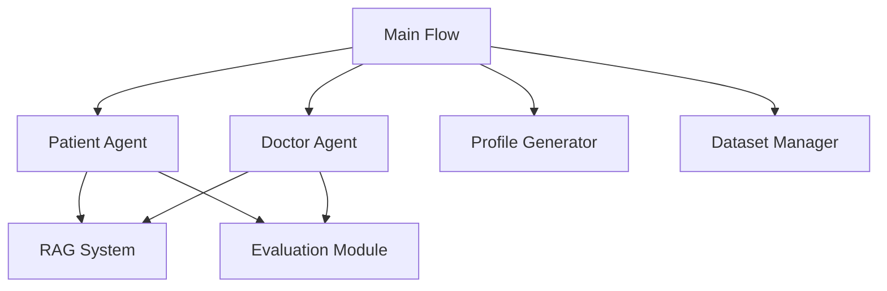

<a name="readme-top"></a>
<h1 align="center">
LLMs Can Simulate Standardized Patients via Agent Coevolution
</h1>

<p align="center">
    <a href="https://arxiv.org/abs/2412.11716"></a>
    <a href=https://github.com/ZJUMAI/EvoPatient"></a>
    <a href="https://www.apache.org/licenses/LICENSE-2.0"></a>
</p>

# EvoPatient
The official repository for our paper [LLMs Can Simulate Standardized Patients via Agent Coevolution](https://arxiv.org/abs/2412.11716).

# Simulated Patient System

A multi-agent simulation system for medical diagnosis that mimics patient-doctor interactions using large language models. This is the official repository for the paper "[LLMs Can Simulate Standardized Patients via Agent Coevolution](https://arxiv.org/abs/2412.11716)".

## Overview

This project implements a sophisticated multi-agent system that simulates realistic patient-doctor interactions in a medical setting. The system consists of:

- **Patient Agents**: Simulate real patients with specific medical conditions, backgrounds, and personalities
- **Doctor Agents**: Represent medical professionals from various specialties who diagnose patients
- **RAG System**: Retrieves relevant medical information to support diagnostic decisions
- **Evaluation Framework**: Assesses the quality of interactions and diagnostic accuracy

## Key Features

### Multi-Agent Architecture
- Dynamic recruitment of specialist doctors based on patient symptoms
- Hierarchical doctor-patient interaction with multiple medical specialties
- Support for different topologies (DAG, tree, chain) for doctor collaboration

### Realistic Patient Simulation
- Diverse patient profiles with detailed backgrounds (age, gender, medical history, etc.)
- Natural language responses that mimic real patient communication patterns
- Crisis scenarios for emergency response training

### Intelligent Doctor Agents
- Specialized knowledge in different medical fields
- Adaptive questioning based on patient responses
- Collaborative diagnosis with other specialist doctors

### Retrieval-Augmented Generation (RAG)
- Context-aware information retrieval for accurate medical responses
- Dynamic information fetching based on current diagnostic needs

## System Architecture



## Components

### 1. Patient Agent (`Simulated/simulated_patient/patient_agent.py`)
- Generates patient profiles with realistic characteristics
- Produces natural language responses to medical questions
- Simulates emergency scenarios during consultations

### 2. Doctor Agent (`Simulated/simulated_patient/doctor_agent.py`)
- Represents medical specialists from various departments
- Dynamically recruits additional specialists when needed
- Makes diagnostic decisions based on patient information

### 3. RAG System (`RAG/`)
- Retrieves relevant medical information for accurate responses
- Supports context-aware information retrieval

## Getting Started

### Prerequisites
- Python 3.8+
- Required packages listed in `requirements.txt`
- OpenAI API key or compatible LLM endpoint

### Installation
```bash
pip install -r requirements.txt
```

### API Key Configuration
Before running the simulation, you need to configure your API keys:

1. **OpenAI API Key**:
   - Edit `Simulated/simulated_patient/api_call.py` 
   - Replace the API key in the `OpenAI` client initialization

2. **Embedding API Key**:
   - Edit `Simulated/simulated_patient/agent_evolve.py`
   - Update the API key and endpoint configuration

3. **Profile Generator API Key**:
   - Edit `profile/profile_generator.py`
   - Modify the `OpenAI` client credentials

### Running the Simulation
```bash
python run.py
```

The system will automatically:
1. Load patient data from the dataset
2. Generate a patient profile
3. Simulate a doctor-patient consultation
4. Evaluate the interaction quality
5. Save results for analysis

## Data Structure

```
Simulated-patient/
├── dataset/                 # Medical patient data
├── profile/                 # Patient profile generation
├── Simulated/               # Core agent implementations
│   ├── simulated_patient/   # Patient and doctor agents
│   └── Prompt/              # LLM prompting templates
├── RAG/                     # Retrieval-augmented generation
└── run.py                   # Main execution script
```

## Configuration

### LLM API Settings
Update API credentials in:
- `Simulated/simulated_patient/api_call.py`
- `embedding_function/qwen_embedding.py`
- `profile/profile_generator.py`

### Simulation Parameters
Adjust settings in:
- `simulateflow.py` - Control simulation flow and parameters
- `run.py` - Configure dataset selection and iteration

## Evaluation Metrics

**Metrics for Patient Agent**

- **Relevance:** Does the answer directly address the question asked, without unnecessary information?
- **Faithfulness:** Is the answer based solely on the provided medical information and scenario requirements?
- **Robustness:** Does the answer avoid inappropriately disclosing sensitive information (like disease names or excessive details) that a doctor should not easily extract?

**Metrics for Doctor Agent**

- **Specificity:** Is the question precise, unambiguous, and focused on specific, relevant details?
- **Targetedness:** Is the question meaningful and efficient for gathering necessary diagnostic information?
- **Professionalism:** Does the question use appropriate medical terminology and reflect an understanding of clinical principles and guidelines?


## 🎥 Demo Video
https://github.com/user-attachments/assets/7a433d03-5f9b-4ada-a491-7c6539cad07e

*EvoPatient system demonstration - showing standardized patient simulation through agent coevolution*

## Citation
```
@inproceedings{du-etal-2025-llms,
    title = {LLMs Can Simulate Standardized Patients via Agent Coevolution},
    author= {Du, Zhuoyun and Zheng, Lujie and Hu, Renjun and Xu, Yuyang and Li, Xiawei and Sun, Ying and Chen, Wei and Wu, Jian and Cai, Haolei and Ying, Haohao},
    booktitle = {Proceedings of the 63rd Annual Meeting of the Association for Computational Linguistics (Volume 1: Long Papers)}
    pages = {17278--17306},
    year = {2025},
}
```

## License

This project is licensed under the Apache 2.0 License, This license permits the use, modification, and distribution of the code, subject to certain conditions outlined in the Apache 2.0 License.
